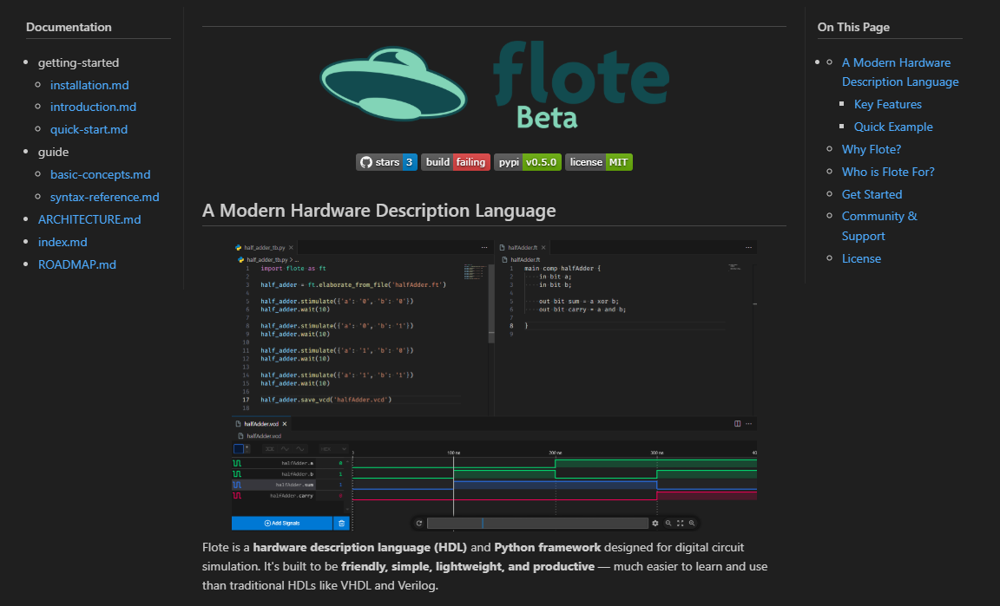

<p align="center">
  
</p>

<h1 align="center">Sydoc</h1>

<p align="center">
  Native documentation navigation for Visual Studio Code.
</p>

<p align="center">
  <a href="https://github.com/icarogabryel/sydoc/actions/workflows/ci.yml">
    
  </a>
  <a href="LICENSE">
    
  </a>
</p>

Sydoc organizes existing Markdown files into a navigable documentation project
inside Visual Studio Code. A project is identified by a `sydoc.yml` file, while
the Markdown files remain the source of truth and can still be edited with the
normal VS Code editor.



## Features

- Define a documentation project with a `sydoc.yml` marker file.
- Discover multiple and nested projects in the same workspace.
- Navigate Markdown files and folders from the native Markdown Preview.
- Build an `On This Page` outline from the current document's headings.
- Use MkDocs-style `nav` entries to define titles and document order.
- Generate relative links that work across nested documentation folders.
- Refresh navigation when Markdown files or directories change.
- Keep normal Markdown editing and VS Code's native Markdown rendering intact.
- Keep the Documentation and `On This Page` panels independently scrollable.

## Requirements

- Visual Studio Code 1.138.0 or later.
- A workspace containing at least one Sydoc project.

Sydoc is currently developed as a VS Code extension. The extension uses VS
Code's native Markdown Preview extension points; it does not provide a
replacement Markdown renderer or a separate editor view.

## Getting started

### Create a project

Create a `sydoc.yml` file in the directory that should be the documentation
root:

```text
workspace/
└── docs/
    ├── sydoc.yml
    ├── index.md
    └── guides/
        └── getting-started.md
```

The file may be empty when using automatic navigation. You can create it from
the Command Palette with:

```text
Sydoc: Initialize Documentation
```

Choose the directory that should become the project root.

### Open the Preview

1. Open a Markdown file inside a Sydoc project.
2. Run `Markdown: Open Preview` or use the Preview button.
3. Use the Documentation panel to navigate the project.
4. Use `On This Page` to jump between headings in the current document.

Sydoc activates its layout only in the Markdown Preview. Opening or editing a
`.md` file continues to use normal VS Code behavior.

The `Sydoc: Open Documentation` command scans the first workspace folder and
reports the number of discovered projects.

## Project configuration

### Automatic navigation

Without a `nav` field, Sydoc builds navigation from Markdown files and
directories below the project root:

```text
docs/
├── sydoc.yml
├── index.md
└── guides/
    ├── first-steps.md
    └── configuration.md
```

Hidden directories, ignored directories, non-Markdown files, and empty
directories are omitted from the navigation.

### Configured navigation

The optional `nav` field follows the MkDocs-style structure:

```yaml
nav:
  - Home: index.md
  - Guides:
      - First steps: guides/first-steps.md
      - Configuration: guides/configuration.md
```

Configured titles and nesting are reflected in the Preview. Entries pointing to
missing or non-Markdown files are ignored. Paths are resolved relative to the
directory containing `sydoc.yml`.

## Project discovery

Discovery is recursive and has no fixed depth. Sydoc supports nested projects
and uses the nearest `sydoc.yml` for a Markdown document.

The following directories are ignored during discovery and navigation:

```text
.git
node_modules
dist
build
out
```

## Development

Clone the repository and install the locked dependencies:

```bash
git clone https://github.com/icarogabryel/sydoc.git
cd sydoc
npm ci
```

Run the validation checks:

```bash
npm run pretest
npm test
```

| Command | Purpose |
| --- | --- |
| `npm run compile` | Compile TypeScript into `out/`. |
| `npm run watch` | Compile continuously while files change. |
| `npm run lint` | Run ESLint against `src/`. |
| `npm run pretest` | Compile and lint the project. |
| `npm test` | Run the VS Code extension test suite. |
| `npm run vscode:prepublish` | Compile before packaging. |

The first test run may download a VS Code test instance into `.vscode-test/`.
That directory is local test data and should not be committed.

Husky is installed automatically by the `prepare` script after dependency
installation. The pre-commit hook runs `npm run lint`.

For setup details, contribution guidelines, Conventional Commits, and Pull
Request expectations, see [CONTRIBUTING.md](CONTRIBUTING.md).

## Architecture

```text
src/
├── core/       Shared configuration
├── projects/   Project discovery and project types
├── preview/    Native Markdown Preview integration and navigation
├── test/       Extension tests
└── extension.ts

media/
├── sydoc-preview.css
└── sydoc-preview.js
```

The Preview integration uses these native VS Code contribution points:

- `markdown.markdownItPlugins` for Preview-side navigation data.
- `markdown.previewStyles` for the three-column layout.
- `markdown.previewScripts` for reorganizing the Preview DOM and building the
  heading outline.

Sydoc preserves the native `.markdown-body` root and rendered Markdown nodes so
features such as task lists, Mermaid, and LaTeX can continue to work with the
native renderer.

## Current limitations

- The `sydoc.yml` schema is intentionally small; the supported configuration is
  currently limited to the optional `nav` field.
- Compatibility with third-party Markdown features such as task lists, Mermaid,
  and LaTeX still needs dedicated verification across supported VS Code
  versions.
- Accessibility and keyboard navigation for the Preview side panels need
  additional validation.
- The extension is not currently distributed through the Visual Studio
  Marketplace.

## Contributing

Bug reports, documentation improvements, tests, and code contributions are
welcome. Please read [CONTRIBUTING.md](CONTRIBUTING.md) before opening a Pull
Request.

## Changelog

See [CHANGELOG.md](CHANGELOG.md) for the project history.

## License

Sydoc is available under the [MIT License](LICENSE).
